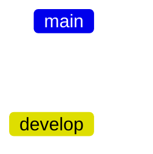
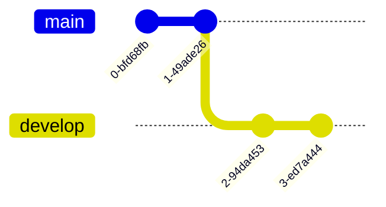

1. Initialiser git
2. Comment envoyer un fichier sur son dêpot GIT
3. Le fichier .gitignore
4. La collaboration avec git
5. Git reset
6. Git stash
7. Git tag


## Initialiser git

Pour initialiser git sur votre appareil en local et pour créer le dossier caché .git qui servira de base à votre projet git, il faut donc taper la commande suivante sur le dossier voulu :

```git
  git init
```
Afin de pouvoir récupérer votre projet sur votre appareil en local, on utilise la commande suivante :

```git
  git clone [lien HTTPS ou bien lien SSH]
```

## Comment envoyer un fichier sur son dêpot GIT

Dans un second temps, voyons comment envoyer ses fichiers et ses répertoires sur GitHub, cette étape est a répété autant de fois que nécessaire.

Pour envoyer vos fichiers/répertoires sur GitHub il faut suivre plusieurs étapes :

```git
git status : permet de visualiser quel est l'état du repository.
```

```git
git add [fichiers ou repertoires] : permet d'indiquer que ces fichiers/répertoires doivent être ajouter au repository.
```

```git
git commit -m "Un commentaire" : permet de valider le ou les git add effectué avant.
```

```gitGraph
    commit
    commit
```

```git
git push : permet d'envoyer vos commits en attentes sur GitHub.
```

## Le fichier .gitignore

Un fichier global .gitignore permet de s’assurer que Git ne valide pas certains types de fichiers, tels que des fichiers binaires compilés, dans un référentiel local. Pour cela il suffit d'ajouter le nom du fichier/dossier que vous ne voulez pas ajouter ou vous pouvez ignorer toutes les extension en mettant un point devant le nom de l'extension example .env

## La collaboration avec git

Il est important de créer une autre branche afin de pouvoir travailler sur une version ou une partie du projet en évitant les conflits lors des pulls vus précedemment.

Tout d'abord, voir si d'autres branches existent déjà sur le projet.

```git
  git branch
```

La branche par défaut est la branche "main" ou bien "master".
Pour créer une autre branche, on utilise la commande suivante : 

```git
  git branch [nom de la branche]
```

Et pour changer de branche, on utilise la commande suivante : 
```git
  git checkout [nom de la branche]
```

Sinon en une seule commande :

```git
  git checkout -b [nom de la branche]
```



## GIT RESET

Réinitialise la zone de préparation pour qu'elle corresponde à la validation la plus récente, mais laisse le répertoire de travail inchangé.
```git
git reset
```

Réinitialise la zone de préparation et le répertoire de travail pour correspondre à la validation la plus récente et écrase toutes les modifications dans le répertoire de travail.
```git
git reset --hard
```

Déplace le curseur de la branche actuelle vers (commit), réinitialise la zone de préparation mais laisse le répertoire de travail en l'état. Les fichiers et répertoires ne sont pas supprimés.
```git
git reset (commit)
```
Identique à la précédente, mais réinitialise à la fois la zone de préparation et le répertoire de travail. Les fichiers et répertoires sont supprimés.
```git
git reset --hard (commit)
```

## Les Etats : Git stash
La commande git stash permet de mettre de côté des modifications non commitées dans votre dépôt Git local. Cela peut être utile lorsque vous souhaitez basculer sur une autre branche pour travailler sur un autre aspect du projet, sans perdre vos modifications en cours.

Voici comment utiliser cette commande :

1. Modifiez les fichiers dans votre répertoire de travail local.

2. Utilisez la commande git stash pour mettre de côté vos modifications non commitées.

3. Basculez sur la nouvelle branche sur laquelle vous souhaitez travailler en utilisant la commande 
```git
git checkout <nom de la branche>.
```

4. Une fois que vous avez terminé de travailler sur la nouvelle branche, vous pouvez utiliser la commande git stash pop pour réappliquer les modifications mises de côté précédemment sur votre répertoire de travail local.
Notez que la commande git stash ne modifie pas le dépôt Git distant, elle ne concerne que les modifications locales sur votre ordinateur.
```git
git stash pop
```
Quelque commande avec stash

```git
$ git stash
```
Enregistre l'état des modifications. Pour mettre un nom sous cet état on utilise git stash save "stash name" && git stash. 

```git
$ git stash list
```
Liste toutes les remises 

```git
$ git stash drop
```
Supprime la remise la plus récente

## ÉTIQUETAGE : GIT TAG

Liste tous les tags.
```git
git tag
```

Permet de rechercher dans les tags : git tag -l. 
```git
git tag -l
```

Ajoute le tag (tag) avec le message associé. (Peut aussi être utilisé sous la forme légère : git tag (votre tag))
On peut étiqueter un commit de cette façon git tag -a (votre tag).
```git
git tag -a (tag) -m 'ma version 1.2'
```

Affiche le (tag) et les informations associées.
```git
git show (tag)
```

Pousse/Récupère tous les tags sur ou du le repo. Pour pousser 1 seul tag : git push origin (votre tag).
```git
git push --tags
git pull --tags
```

Supprime un tag en local.
```git
git tag -d (votre tag)
```

Supprime un (tag) sur le (repo).
```git
git push (repo) --delete (tag)
```


