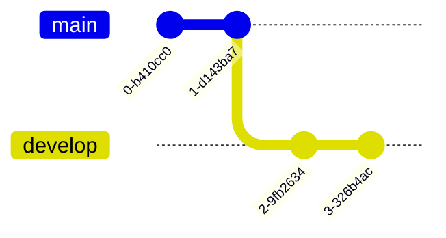

# git-cheatsheet

## Initiation de l'exercice

A partir de ce dépôt-ci, réalisez une cheatsheet de git. 

Dans un premier temps réalisez un fork de ce dépôt et répartissez vous ce projet pour travailler à deux ou trois. 

Le livrable final attendu :
- Avoir un sommaire
- Avoir des sections pour chaque fonctionnalité de git. Cette section doit contenir les commandes de base 
	- commit / add / log / squash / branch / checkout / revert / reset ...
- Pour chaque instruction, il est attendu d'avoir une description textuelle
- Pour chaque section il est attendu d'avoir un petit graph mermaid

## Initialiser git

Pour initialiser git sur votre appareil en local et pour créer le dossier caché .git qui servira de base à votre projet git, il faut donc taper la commande suivante sur le dossier voulu :

```git
  git init
```

Afin de pouvoir récupérer votre projet sur votre appareil en local, on utilise la commande suivante :

```git
  git clone [lien HTTPS ou bien lien SSH]
```

## La collaboration avec git

Il est important de créer une autre branche afin de pouvoir travailler sur une version ou une partie du projet en évitant les conflits lors des pulls vus précedemment.

Tout d'abord, voir si d'autres branches existent déjà sur le projet.

```git
  git branch
```

La branche par défaut est la branche "main" ou bien "master".
Pour créer une autre branche, on utilise la commande suivante : 

```git
  git branch [nom de la branche]
```

Et pour changer de branche, on utilise la commande suivante : 

```git
  git checkout [nom de la branche]
```

Sinon en une seule commande :

```git
  git checkout -b [nom de la branche]
```


## La collaboration avec git

Il est important de créer une autre branche afin de pouvoir travailler sur une version ou une partie du projet en évitant les conflits lors des pulls vus précedemment.

Tout d'abord, voir si d'autres branches existent déjà sur le projet.

```git
  git branch
```

La branche par défaut est la branche "main" ou bien "master".
Pour créer une autre branche, on utilise la commande suivante : 

```git
  git branch [nom de la branche]
```

Et pour changer de branche, on utilise la commande suivante : 

```git
  git checkout [nom de la branche]
```

Sinon en une seule commande :

```git
  git checkout -b [nom de la branche]
```


## Livraison de l'exercice

En fin de journée, réaliser une merge request au formateur. 
  - Attention, l'historique des commits doit être propre. 
  - Ainsi un commit par fonctionnalité présentée
  - Utilisation des branches
  - Une feature par fonctionnalité
